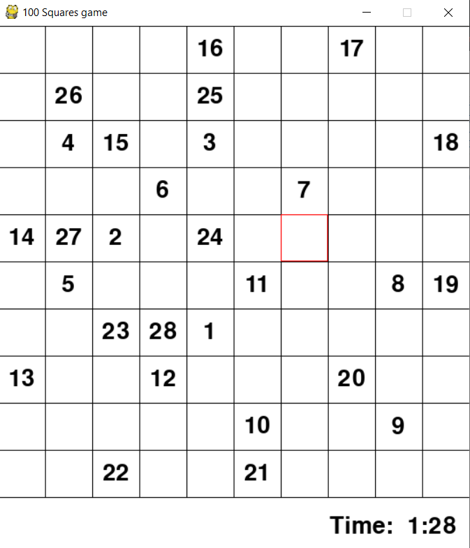

## Python 100 Squares game

This is my python version of this game https://madewithreact.com/100-squares-game/ with two additional features. 
Pressing Enter checks if there are still valid squares you can move to or if you've
completed the game (filled all squares) if there are no valid squares left or you've completed the game
it closes the program. Pressing backspace removes the last placed number so you don't have to restart
if you make a mistake. 

GUI is made by modyfying a sudoku implentation in pygame I found. 

Picture of game:

